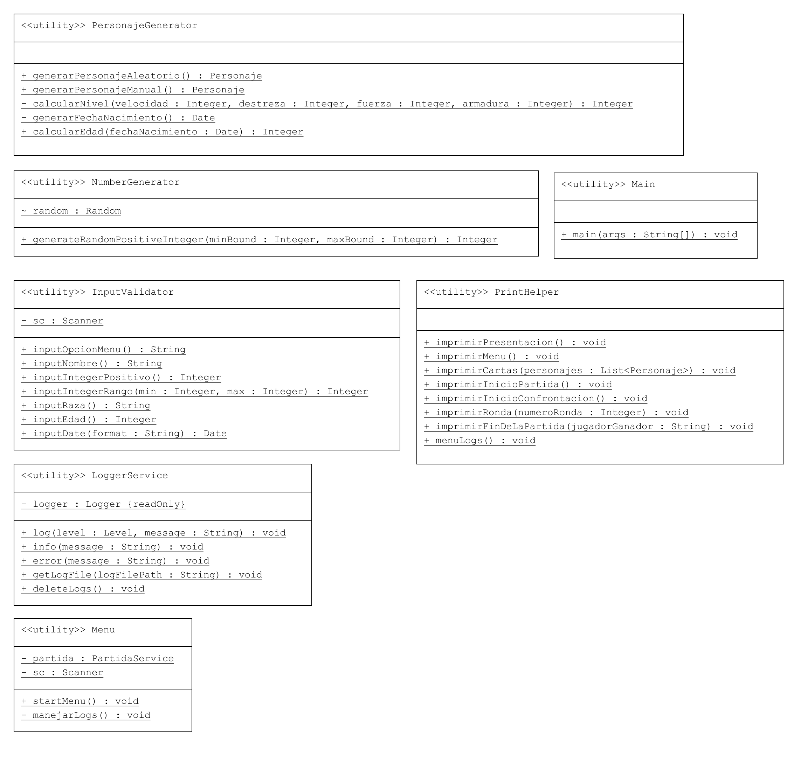

# Quillcraft

Esta aplicación como proyecto evaluativo final para la materia Programacion III, de la TUP. UTN FRBB. 

## Tabla de Contenidos

-  [Consideraciones](#consideraciones)
-  [Herramientas](#herramientas)
-  [Desarrollo juego](#desarrollo-juego)
-  [Diagrama UML](#diagrama-uml)
-  [Autoras](#autoras)
-  [Reconocimientos](#reconocimientos)

### Consideraciones
Esta aplicación se desarrollo para que pueda verse con su "interfaz" en consola. En parte del código se pueden encontrar pantallas creadas en Swing, ya que la idea original era poder desarrollarlo con una interfaz grafica. Finalmente esta idea se abandono por falta de tiempo. 

Para el desarrollo de la app, se han utilizado datos estáticos, los cuales se encuentran dentro del código en clases de utilities. 

### Herramientas
 - Se desarrollo en Java en el IDE IntelliJ Community Edition.  
 - Para la generación de nombres aleatorios y frases se utilizo la herramienta
   ChatGPT.
 - Para la generacion de algunos decorados se utilizo [Text to ASCII art Generator](https://patorjk.com/software/taag/)
 
### Desarrollo juego
El juego se desarrolla mediante el enfrentamiento del jugador con la maquina. Consiste en generar 3 cartas para cada jugador, y luego ronda a ronda iran enfrentándose aleatoriamente una carta del jugador con una carta de la maquina. 
Cuenta con dos modos de juego:
 **- Modo de juego aleatorio:** se generan 6 cartas aleatorias de forma automática, y se les asigna 3 al jugador y 3 a la maquina. 
  **- Modo de juego manual:** se le permite al usuario ingresar los datos para generar 3 cartas de forma manual, y se generan 3 cartas aleatorias de forma que se les asignan a la maquina.

### Diagrama UML
**Completo**

**Herencia y polimorfismo**

**Clases de utilidades**

### Autora

 - Alvarez, Marcia Belen 

### Diseño SWING
Si bien esta parte no pude llevarla a cabo, de cualquier forma quería dejar plasmado el diseño de las cartas y un primer desarrollo de la pantalla para futura referencias. 
Si se desea verlo, esta guardado en el commit con el hash [commit 844d40f](https://github.com/marciabel/quillcraft/commit/844d40fa1a9c9300564055e241d223536cf41f93)

Como proyecto personal me gustaría poder ejecutarlo con la UI en un futuro. 

